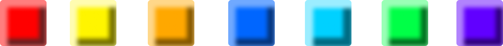
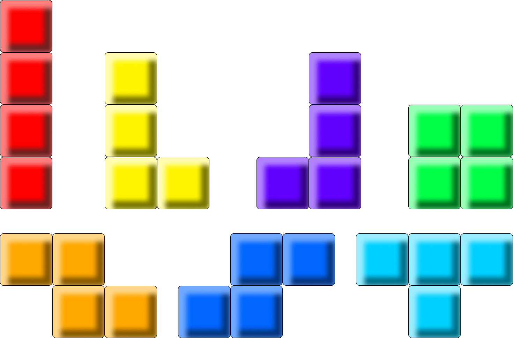
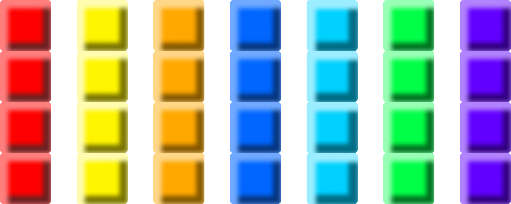
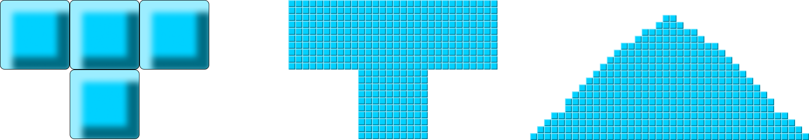

# Dokumentation: Powder

FS 2024, Fortgeschrittene Web Technologien, Fabian Diemand  
Dozent: Christian Klauenbösch  
Repository: [Powder GitLab Repository](https://git.ffhs.ch/web-technologien/fwebt/fs24/infp-w-af004-fwebt_pibs-be-1-pva/studs/fwebt-fs24-powder)
--- 
## Inhalt
<!-- TOC -->
* [Dokumentation: Powder](#dokumentation-powder)
  * [Inhalt](#inhalt)
  * [1 Projektidee und Geschäftsregeln](#1-projektidee-und-geschäftsregeln)
    * [1.1 Kontext des Projekts](#11-kontext-des-projekts)
    * [1.2 Projektidee](#12-projektidee)
    * [1.3 Erklärung des Spiels](#13-erklärung-des-spiels)
    * [1.4 Abgrenzungen](#14-abgrenzungen)
  * [2 Technologie Stack](#2-technologie-stack)
    * [2.1 React + Typescript](#21-react--typescript)
    * [2.2 Node Package Manager (npm)](#22-node-package-manager-npm)
    * [2.3 Tailwind + DaisyUI](#23-tailwind--daisyui)
    * [2.4 MongoDB](#24-mongodb)
    * [2.5 Socket.io](#25-socketio)
    * [2.6 Docker](#26-docker)
    * [2.7 GitLab](#27-gitlab)
<!-- TOC -->

---

## 1 Projektidee und Geschäftsregeln

### 1.1 Kontext des Projekts
Das Projekt wird im Rahmen einer Semesterarbeit für das Modul "Fortgeschrittene Web Technologien" umgesetzt. 
Das Modul ist Bestandteil des praxisintegrierten Bachelorstudiums (PiBS) Informatik 
an der Fernfachhochschule Schweiz (FFHS) und wird doziert durch Christian Klauenbösch. 

### 1.2 Projektidee
Powder ist ein Spiel, das im Grundsatz Tetris ähnelt. 
Originale Tetris Blöcke (Tetrominos) wären für eine Semesterarbeit zu teuer gewesen. 
Daher wird auf die billige Import-Variante (Powdrominos) ausgewichen. 
Powdrominos zerfallen zwar beim Aufprall, aber was soll's...

Neben der Spiellogik werden ein Scoreboard und ein Lobby-Chat implementiert. 
Voraussetzung für das Scoreboard ist die Persistierung von Spielständen mit den zugehörigen Spielernamen. 
Auch die Chat-Nachrichten werden persistiert, damit die Historie nachvollziehbar ist.

Als Erweiterungen des Projekts wären lokale oder gar remote Multiplayer-Modi denkbar.
Beim lokalen Multiplayer würden beide Spieler am gleichen Gerät spielen. 
Beim remoten würden die Spieler an unterschiedlichen Geräten spielen und die Zustände der Spielfelder würden über Websockets synchronisiert.

### 1.3 Erklärung des Spiels
Grundlegend sind die Spielregeln von Tetris.
Von Tetris übernommen werden ausserdem die Blockformen und Blockfarben.

Powdrominos sind **nicht** entsprechend ihrer Form gefärbt. Jede Form kann jede Farbe haben.

Die Blöcke, aus denen Powdrominos gebaut sind bestehen aus Substrukturen, die 10x kleiner sind, als die Blöcke selbst.
Beim Aufprall auf den Boden des Spielfelds oder auf andere Blöcke, zerfallen sie in diese Substrukturen.
Die Substrukturen haben eine eigene Physik bzw. Schwerkraft und bilden in der Folge Haufen.

Das Ziel des Spiels ist weiterhin, eine Reihe von Elementen vom linken zum rechten Spielfeldrand zu bilden.
Da die Powdrominos jedoch beim Aufprall zerfallen, spielt es keine Rolle, ob die verbindende Reihe von Elementen horizontal ist, oder nicht.
Wichtig ist lediglich, dass vom linken zum rechten Spielfeldrand eine durchgehende Verbindung mit Elementen der gleichen Farbe entsteht.
Ist diese Voraussetzung erfüllt, werden sämtliche Blöcke dieser Farbe, welche zum verbindenden Komplex gehören, entfernt.
Die Punktvergabe erfolgt aufgrund der sich im entfernten Komplex befindlichen Substrukturen, welche jeweils einen Punkt geben. 

Ferner gibt es einen Punktmultiplikator, entsprechend der Anzahl entfernter Substrukturen:
- Faktor 1.5: Wenn Substrukturen für zwei komplette Reihen entfernt werden (Spielfeldbreite x 10 x 2)
- Faktor 2.5: Wenn Substrukturen für drei komplette Reihen entfernt werden (Spielfeldbreite x 10 x 3)
- Faktor 4: Wenn Substrukturen für vier komplette Reihen entfernt werden (Spielfeldbreite x 10 x 4)

Damit wird die beim regulären Tetris ein höheres Risiko beim Stapeln der Elemente belohnt.

### 1.4 Abgrenzungen
Die Architekturvorgabe für die Semesterarbeit ist, dass die hauptsächliche Spiellogik clientseitig (heisst im Browser) stattfinden muss.
Das minimale Backend, welches dennoch implementiert wird, dient lediglich als Schnittstelle zur Persistierungsschicht und als zentrale Stelle für die
Kommunikation über die Websockets.

Da auch die Zustandsverwaltung somit im Browser stattfindet, sind sämtliche Massnahmen zur Sicherstellung der Integrität der Spielzustände (Unterbinden von Manipulationen der Spiellogik innerhalb der Session) hinfällig.

## 2 Technologie Stack

### 2.1 React + Typescript

### 2.2 Node Package Manager (npm)

### 2.3 Tailwind + DaisyUI

### 2.4 MongoDB

### 2.5 Socket.io

### 2.6 Docker

### 2.7 GitLab