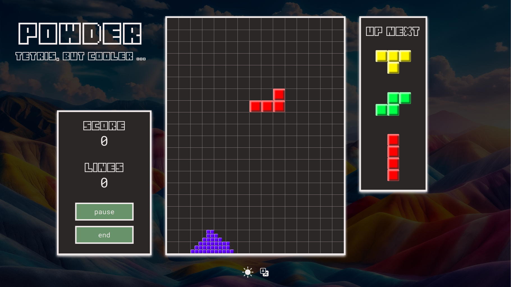
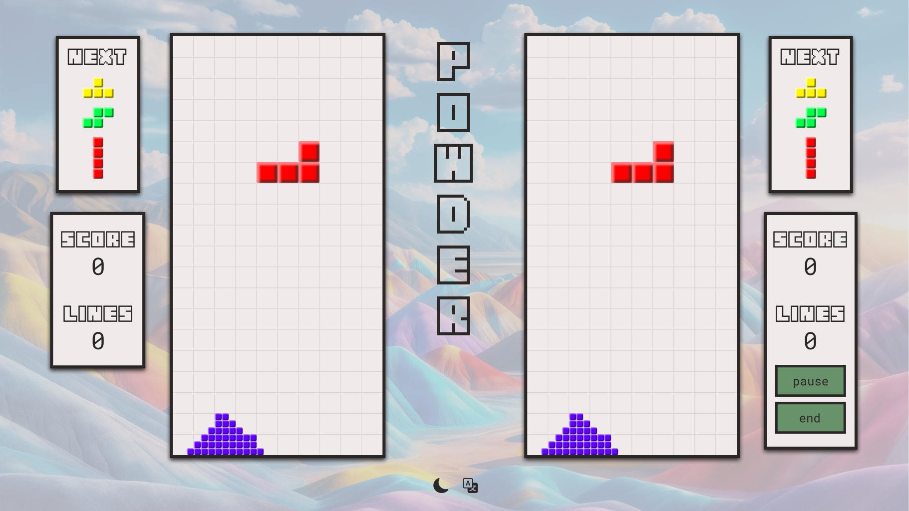

# Dokumentation: Powder

FS 2024, Fortgeschrittene Web Technologien, Fabian Diemand  
Dozent: Christian Klauenbösch  
Repository: [Powder GitLab Repository](https://git.ffhs.ch/web-technologien/fwebt/fs24/infp-w-af004-fwebt_pibs-be-1-pva/studs/fwebt-fs24-powder)

--- 

## Inhalt

<!-- TOC -->
- [Dokumentation: Powder](#dokumentation-powder)
  - [Inhalt](#inhalt)
  - [1 Projektidee und Geschäftsregeln](#1-projektidee-und-geschäftsregeln)
    - [1.1 Kontext des Projekts](#11-kontext-des-projekts)
    - [1.2 Projektidee](#12-projektidee)
    - [1.3 Erklärung des Spiels](#13-erklärung-des-spiels)
    - [1.4 Abgrenzungen](#14-abgrenzungen)
  - [2 Technologie Stack](#2-technologie-stack)
    - [2.1 React + Typescript](#21-react--typescript)
    - [2.2 Node Package Manager (npm)](#22-node-package-manager-npm)
    - [2.3 Tailwind + DaisyUI](#23-tailwind--daisyui)
    - [2.4 i18next](#24-i18next)
    - [2.5 MongoDB](#25-mongodb)
    - [2.6 Socket.io](#26-socketio)
    - [2.7 Docker](#27-docker)
    - [2.8 GitLab](#28-gitlab)
    - [2.9 Weitere Dependencies](#29-weitere-dependencies)
  - [3 Funktionale Anforderungen](#3-funktionale-anforderungen)
    - [3.1 MUSS-Anforderungen](#31-muss-anforderungen)
      - [3.1.1 FA-001 Spielername](#311-fa-001-spielername)
      - [3.1.2 FA-002 Spiel-Start](#312-fa-002-spiel-start)
      - [3.1.3 FA-003 Spiel-Pause](#313-fa-003-spiel-pause)
      - [3.1.4 FA-004 Spiel-Abbruch](#314-fa-004-spiel-abbruch)
      - [3.1.5 FA-005 Powdromino Vorschau](#315-fa-005-powdromino-vorschau)
      - [3.1.6 FA-006 Powdromino bewegen](#316-fa-006-powdromino-bewegen)
      - [3.1.7 FA-007 Powdromino drehen](#317-fa-007-powdromino-drehen)
      - [3.1.8 FA-009 Powdromino Zerfall](#318-fa-009-powdromino-zerfall)
      - [3.1.9 FA-011 Reihe entfernen](#319-fa-011-reihe-entfernen)
      - [3.1.10 FA-012 Niederlage](#3110-fa-012-niederlage)
      - [3.1.11 FA-013 Score zählen einfach](#3111-fa-013-score-zählen-einfach)
      - [3.1.12 FA-014 Score zählen mit Multiplikator](#3112-fa-014-score-zählen-mit-multiplikator)
      - [3.1.13 FA-015 Scoreboard](#3113-fa-015-scoreboard)
    - [3.2 KANN-Anforderungen](#32-kann-anforderungen)
      - [3.2.1 FA-016 Lokaler Multiplayer-Modus](#321-fa-016-lokaler-multiplayer-modus)
      - [3.2.2 FA-017 Lobby-Chat](#322-fa-017-lobby-chat)
      - [3.2.3 FA-018 Remote Multiplayer-Modus](#323-fa-018-remote-multiplayer-modus)
      - [3.2.4 FA-008 Powdromino beschleunigen](#324-fa-008-powdromino-beschleunigen)
      - [3.2.5 FA-010 Schwierigkeitsgrade](#325-fa-010-schwierigkeitsgrade)
  - [4 Nicht-Funktionale Anforderungen](#4-nicht-funktionale-anforderungen)
    - [4.1 MUSS-Anforderungen](#41-muss-anforderungen)
      - [4.1.1 NFA-001 Client-Server](#411-nfa-001-client-server)
      - [4.1.2 NFA-002 Persistenz](#412-nfa-002-persistenz)
    - [4.2 KANN-Anforderungen](#42-kann-anforderungen)
      - [4.2.1 NFA-003 Internationalisierung](#421-nfa-003-internationalisierung)
    - [4.2.2 NFA-004 Light-/ Dark-Mode](#422-nfa-004-light--dark-mode)
  - [5 Planung](#5-planung)
    - [5.1 Prototypen](#51-prototypen)
      - [5.1.1 Landing Page](#511-landing-page)
      - [5.1.2 Menü Page](#512-menü-page)
      - [5.1.3 Game Page: Singleplayer Einfach](#513-game-page-singleplayer-einfach)
      - [5.1.4 Game Page: Singleplayer Schwer](#514-game-page-singleplayer-schwer)
      - [5.1.5 Game Page: Multiplayer](#515-game-page-multiplayer)
    - [5.2 Architekturentscheidungen](#52-architekturentscheidungen)
      - [5.2.1 Architektur Global](#521-architektur-global)
<!-- TOC -->

---

## 1 Projektidee und Geschäftsregeln

### 1.1 Kontext des Projekts

Das Projekt wird im Rahmen einer Semesterarbeit für das Modul "Fortgeschrittene Web Technologien" umgesetzt.
Das Modul ist Bestandteil des praxisintegrierten Bachelorstudiums (PiBS) Informatik
an der Fernfachhochschule Schweiz (FFHS) und wird doziert durch Christian Klauenbösch.

### 1.2 Projektidee

Powder ist ein Spiel, das im Grundsatz Tetris ähnelt.
Originale Tetris Blöcke (Tetrominos) wären für eine Semesterarbeit zu teuer gewesen.
Daher wird auf die billige Import-Variante (Powdrominos) ausgewichen.
Powdrominos zerfallen zwar beim Aufprall, aber was soll's...

Neben der Spiellogik werden ein Scoreboard und ein Lobby-Chat implementiert.
Voraussetzung für das Scoreboard ist die Persistierung von Spielständen mit den zugehörigen Spielernamen.
Auch die Chat-Nachrichten werden persistiert, damit die Historie nachvollziehbar ist.

Als Erweiterungen des Projekts wären lokale oder gar remote Multiplayer-Modi denkbar.
Beim lokalen Multiplayer würden beide Spieler am gleichen Gerät spielen.
Beim remoten würden die Spieler an unterschiedlichen Geräten spielen und die Zustände der Spielfelder würden über
Websockets synchronisiert.

### 1.3 Erklärung des Spiels

Grundlegend sind die Spielregeln von Tetris.
Von Tetris übernommen werden ausserdem die Blockformen und Blockfarben.

<!--suppress CheckImageSize -->

Powdrominos sind **nicht** entsprechend ihrer Form gefärbt. Jede Form kann jede Farbe haben.

Die Blöcke, aus denen Powdrominos gebaut sind bestehen aus Substrukturen, die 10x kleiner sind, als die Blöcke selbst.
Beim Aufprall auf den Boden des Spielfelds oder auf andere Blöcke, zerfallen sie in diese Substrukturen.
Die Substrukturen haben eine eigene Physik bzw. Schwerkraft und bilden in der Folge Haufen.

Das Ziel des Spiels ist weiterhin, eine Reihe von Elementen vom linken zum rechten Spielfeldrand zu bilden.
Da die Powdrominos jedoch beim Aufprall zerfallen, spielt es keine Rolle, ob die verbindende Reihe von Elementen
horizontal ist, oder nicht.
Wichtig ist lediglich, dass vom linken zum rechten Spielfeldrand eine durchgehende Verbindung mit Elementen der gleichen
Farbe entsteht.
Ist diese Voraussetzung erfüllt, werden sämtliche Blöcke dieser Farbe, welche zum verbindenden Komplex gehören,
entfernt.
Die Punktvergabe erfolgt aufgrund der sich im entfernten Komplex befindlichen Substrukturen, welche jeweils einen Punkt
geben.

Ferner gibt es einen Punktmultiplikator, entsprechend der Anzahl entfernter Substrukturen:

- Faktor 1.5: Wenn Substrukturen für zwei komplette Reihen entfernt werden (Spielfeldbreite x 10 x 2)
- Faktor 2.5: Wenn Substrukturen für drei komplette Reihen entfernt werden (Spielfeldbreite x 10 x 3)
- Faktor 4: Wenn Substrukturen für vier komplette Reihen entfernt werden (Spielfeldbreite x 10 x 4)

Damit wird die beim regulären Tetris ein höheres Risiko beim Stapeln der Elemente belohnt.

### 1.4 Abgrenzungen

Die Architekturvorgabe für die Semesterarbeit ist, dass die hauptsächliche Spiellogik clientseitig (heisst im Browser)
stattfinden muss.
Das minimale Backend, welches dennoch implementiert wird, dient lediglich als Schnittstelle zur Persistierungsschicht
und als zentrale Stelle für die
Kommunikation über die Websockets.

Da auch die Zustandsverwaltung somit im Browser stattfindet, sind sämtliche Massnahmen zur Sicherstellung der Integrität
der Spielzustände (Unterbinden von Manipulationen der Spiellogik innerhalb der Session) hinfällig.

## 2 Technologie Stack

### 2.1 React + Typescript

[ReactJS](https://reactjs.org/) ist eine Bibliothek zur Erstellung von webbasierten UIs. Ein spezielles Merkmal der
Library ist die komponentenbasierte Herangehensweise an
die Erstellung einer grafischen Benutzeroberfläche. So können repetitive Muster sehr effizient und effektiv umgesetzt
und gewartet werden.
Für das Projekt wird React 18 verwendet.

### 2.2 Node Package Manager (npm)

Der [Node Package Manager (npm)](https://docs.npmjs.com/about-npm) wird für das Dependency Management eingesetzt.
NPM bietet zum einen die CLI, welche die Interaktion mit npm erlaubt, zum anderen die Registry, welche die
entsprechenden Packages beinhaltet.
Für das Projekt wird npm Version 10.4.0 eingesetzt.

### 2.3 Tailwind + DaisyUI

[Tailwind](https://tailwindcss.com/) und [DaisyUI](https://daisyui.com/) werden für das Styling des Spiels eingesetzt.
Tailwind erlaubt das Styling ohne viel CSS und direkt durch HTML-Klassen bzw. JSX-Klassennamen.
Damit und mit einer bedachten Komponenten-Aufteilung des GUI können schnell optisch ansprechende Resultate erzielt
werden.
Gleichzeitig bietet Tailwind dem Entwickler viele Möglichkeiten, eigene Styles mit CSS zu implementieren oder mit der
Konfiguration das Verhalten von Tailwind zu beeinflussen.
Tailwind wird in der Version 3.4.1 verwendet.

DaisyUI integriert mit Tailwind und bietet vorgefertigte Komponenten für Standard-Elemente von GUIs an. Dadurch kann die
Optik des Spiels mit überschaubarem Aufwand merklich aufgewertet werden.
Für DaisyUI kommt die Version 4.6.2 eingesetzt.

### 2.4 i18next
[i18next](https://www.i18next.com/) ist ein Framework für die Internationalisierung von Web-Anwendungen und integriert über ein dediziertes Modul ([i18next-react](https://github.com/i18next/react-i18next)) direkt mit React, 
wodurch Übersetzungen aus den entsprechenden JSON-Files direkt über einen Hook zugänglich werden.

### 2.5 MongoDB

Die Persistenz im Projekt wird mit [MongoDB](https://www.mongodb.com/) umgesetzt. MongoDB ist eine NoSQL
Dokumentdatenbank, die sehr oft für Web Development verwendet wird.
Datensätze werden als Dokumente (in unserem Fall in JSON) abgelegt. Sammlungen von Dokumenten werden Collections
genannt (z.B. Score-Collection, mit einzelnen Spielstand-Documents, oder Chat-Collection mit Chat-Documents).
Aufgrund der hohen Flexibilität, Skalierbarkeit und Einfachheit in der Anwendung wird für das Projekt eine NoSQL
Datenbank verwendet.

Da MongoDB mit [Mongo Atlas](https://www.mongodb.com/atlas/database) kostenfrei (begrenzt) eine Cloud-Datenbank zur
Verfügung stellt
und der Autor bereits Erfahrung mit deren Verwendung hat, fällt die Wahl auf das Produkt für die finale Abgabe.

Während der Entwicklung wird ein Mongo-Container in Docker verwendet.

### 2.6 Socket.io

Für die Echtzeitkommunikation zwischen Server(n) und Webclients kommt [Socket.io](https://socket.io/) zum Einsatz.
Socket.IO nutzt das [WebSocket Protokoll](https://en.wikipedia.org/wiki/WebSocket), um eine bidirektionale, nahezu
verzögerungsfreie Verbindung
zwischen Server und Client aufzubauen. Zusätzliche Funktionalitäten wie HTTP long-polling (Server schickt Response erst,
wenn Daten vorhanden sind) als Fallback zur regulären WebSocket-Verbindung, automatisches Wiederherstellen der
Verbindung nach Unterbrüchen, Pufferung von
Datenpaketen und der Möglichkeit, Acknowledgments zu senden, eignet sich Socket.io bestens zur Verwendung im Projekt für
die Chatfunktion und später eventuell für den remote Multiplayer.

Im Projekt wird die aktuellste Version von Socket.io gemäss [npmjs.com](https://www.npmjs.com/package/socket.io)
verwendet (z.Z. 4.7.4)

### 2.7 Docker

[Docker](https://www.docker.com/) wird während der Entwicklung für Dev Containers eingesetzt, damit keine Dependencies
und Services lokal installiert werden müssen.

Weiter erfolgt die Abgabe, sowohl des Backends als auch des Frontends, um die Installation zu vereinfachen und den
Aufwand auf das Clonen des Repositories und wenige Commands zu reduzieren.

### 2.8 GitLab

Für die Source-Code-Verwaltung und die Versionierung wird GitLab verwendet. Innerhalb von Gitlab werden insbesondere
Issues verwendet,
um User Stories und Tasks zu erfassen. Zu Planungszwecken wird ausserdem ein Board mit den Phasen "Backlog", "Sprint
Backlog", "Development",
"Verification" und "Done" erstellt. Die Branch-Strategie folgt grundsätzlich den Empfehlungen des Git-flow-Workflow.

### 2.9 Weitere Dependencies

**ESLint + typescript-eslint + eslint-plugin-react**  
[ESLint](https://eslint.org/), [typescript-eslint](https://typescript-eslint.io/) und [eslint-plugin-react](https://github.com/jsx-eslint/eslint-plugin-react) werden eingesetzt, um den Code statisch und regelbasiert auf Fehler zu überprüfen. Die Grundfunktionalität des Lintings wird mit ESLint eingeführt. typescript-eslint ergänzt die Unterstützung für TypeScript und eslint-plugin-react enthält React-spezifische Regeln.

Die Konfiguration von ESLint kann sich im Projektverlauf verändern.

**Prettier + eslint-config-prettier**  
[Prettier](https://prettier.io/) und [eslint-config-prettier](https://github.com/prettier/eslint-config-prettier) werden für die Formatierung des Sourcecodes eingesetzt. Mit Prettier wird dabei die Formatierungsfunktionalität eingeführt. eslint-config-prettier muss in der Konfiguration von ESLint verwendet werden, damit hinsichtlich der Formatierung keine Konflikte zwischen Prettier uns ESLint entstehen.

Die Konfiguration von Prettier kann sich im Projekverlauf verändern.

**Webpack + Babel**  
[Webpack](https://webpack.js.org/) und [Babel](https://babeljs.io/) werden eingesetzt, um den für die Entwicklung des Spiels verwendeten Sprachstandard von JavaScript/ TypeScript in Browser-kompatibles JavaScript der Version ES5 zu transpilieren. Der Vorgang des Transpilierens wird durch Babel vorgenommen. Webpack bündelt die Resourcen für die Anwendung (nur clientseitig!) in ein grosses JavaScript-File, um die Performance im Browser zu steigern, ohne die Möglichkeiten der Modularität während der Entwicklung einzuschränken.

Für Webpack und Babel werden weitere kleine Abhängigkeiten und Plugins installiert, auf welche im Rahmen der Dokumentation nicht detailliert eingegangen wird.

## 3 Funktionale Anforderungen

### 3.1 MUSS-Anforderungen

#### 3.1.1 FA-001 Spielername
<table>
  <tr>
    <th>ID</th>
    <td>FA-001</td>
  </tr>
  <tr>
    <th>Name</th>
    <td>Spielername</td>
  </tr>
  <tr>
    <th>Ziel</th>
    <td>Besucher müssen einen Namen angeben, bevor sie zur Start-Übersicht des Spiels gelangen und als Spieler erachtet werden.</td>
  </tr>
  <tr>
    <th>Akteure</th>
    <td>Neuer Besucher</td>
  </tr>
  <tr>
    <th>Ereignis</th>
    <td>Akteure besuchen die Seite des Spiels.</td>
  </tr>
  <tr>
    <th>Vorbedingung Standardablauf</th>
    <td>Akteure haben die Seite bisher nicht aktiv zum Spielen verwendet, bzw. der Browser kennt keinen Spielernamen für das Spiel.</td>
  </tr>
  <tr>
    <th>Standardablauf</th>
    <td>1. Pop-up wird angezeigt, welches zur Eingabe des Namens auffordert 2. Akteur tippt gewünschten Namen ein 3. Akteur klickt auf "Speichern"-Knopf</td>
  </tr>
  <tr>
    <th>Alternativablauf</th>
    <td>1a. Falls der Browser einen Spielernamen kennt: Akteur wird direkt als Spieler erkannt und zur Start-Übersicht weitergeleitet 2a. Falls der Akteur keinen Namen eintippt: Formular kann nicht abgeschlossen werden</td>
  </tr>
  <tr>
    <th>Nachbedingung Erfolg</th>
    <td>Akteur ist im Spiel mit dem gewünschten Spielernamen hinterlegt.</td>
  </tr>
  <tr>
    <th>Nachbedingung Alternativ</th>
    <td>Spieler kommt nicht aus dem Pop-Up für die Namenseingabe heraus.  Falls doch, ist jede Aktion auf der Start-Übersicht mit einer weiteren Namensüberprüfung verbunden.</td>
  </tr>
  <tr>
    <th>Klassifizierung</th>
    <td>Funktional, MUSS</td>
  </tr>
  <tr>
    <th>Aufwand</th>
    <td>Klein</td>
  </tr>
</table>

#### 3.1.2 FA-002 Spiel-Start
<table>
  <tr>
    <th>ID</th>
    <td>FA-002</td>
  </tr>
  <tr>
    <th>Name</th>
    <td>Spiel starten</td>
  </tr>
  <tr>
    <th>Ziel</th>
    <td>Spieler können ein neues Spiel starten.</td>
  </tr>
  <tr>
    <th>Akteure</th>
    <td>Spieler</td>
  </tr>
  <tr>
    <th>Ereignis</th>
    <td>Akteur klickt auf den "Spielen"-Knopf.</td>
  </tr>
  <tr>
    <th>Vorbedingung Standardablauf</th>
    <td>Akteur ist dem Spiel mit einem Spielernamen bekannt.</td>
  </tr>
  <tr>
    <th>Standardablauf</th>
    <td>1. Ein neues Spiel wird gestartet</td>
  </tr>
  <tr>
    <th>Alternativablauf</th>
    <td>1a. Falls kein Spielername bekannt ist: Das Pop-Up für die Namenseingabe wird angezeigt</td>
  </tr>
  <tr>
    <th>Nachbedingung Erfolg</th>
    <td>Akteur befindet sich in einem laufenden Spiel.</td>
  </tr>
  <tr>
    <th>Nachbedingung Alternativ</th>
    <td>Akteur muss Spielernamen angeben (vgl. Anforderung 1).</td>
  </tr>
  <tr>
    <th>Klassifizierung</th>
    <td>Funktional, MUSS</td>
  </tr>
  <tr>
    <th>Aufwand</th>
    <td>Klein</td>
  </tr>
</table>

#### 3.1.3 FA-003 Spiel-Pause
<table>
  <tr>
    <th>ID</th>
    <td>FA-003</td>
  </tr>
  <tr>
    <th>Name</th>
    <td>Spiel pausieren</td>
  </tr>
  <tr>
    <th>Ziel</th>
    <td>Spieler können ein laufendes Spiel pausieren.</td>
  </tr>
  <tr>
    <th>Akteure</th>
    <td>Spieler</td>
  </tr>
  <tr>
    <th>Ereignis</th>
    <td>Akteur klickt auf den "Pause"-Knopf.</td>
  </tr>
  <tr>
    <th>Vorbedingung Standardablauf</th>
    <td>Akteur befindet sich in einem laufenden Spiel.</td>
  </tr>
  <tr>
    <th>Standardablauf</th>
    <td>1. Das laufende Spiel wird pausiert 2. Ein Pop-Up wird angezeigt, das das Fortsetzen und Beenden des Spiels anbietet 3. Akteur klickt den "Fortsetzen"-Knopf</td>
  </tr>
  <tr>
    <th>Alternativablauf</th>
    <td>3a. Akteur klickt den "Beenden"-Knopf</td>
  </tr>
  <tr>
    <th>Nachbedingung Erfolg</th>
    <td>Akteur befindet sich in einem laufenden Spiel.</td>
  </tr>
  <tr>
    <th>Nachbedingung Alternativ</th>
    <td>Das Spiel wird beendet und der Akteur wird zur Start-Übersicht weitergeleitet.</td>
  </tr>
  <tr>
    <th>Klassifizierung</th>
    <td>Funktional, MUSS</td>
  </tr>
  <tr>
    <th>Aufwand</th>
    <td>Klein</td>
  </tr>
</table>

#### 3.1.4 FA-004 Spiel-Abbruch
<table>
  <tr>
    <th>ID</th>
    <td>FA-004</td>
  </tr>
  <tr>
    <th>Name</th>
    <td>Spiel abbrechen</td>
  </tr>
  <tr>
    <th>Ziel</th>
    <td>Spieler können ein laufendes Spiel abbrechen.</td>
  </tr>
  <tr>
    <th>Akteure</th>
    <td>Spieler</td>
  </tr>
  <tr>
    <th>Ereignis</th>
    <td>Akteur klickt auf den "Abbrechen"-Knopf.</td>
  </tr>
  <tr>
    <th>Vorbedingung Standardablauf</th>
    <td>Akteur befindet sich in einem laufenden Spiel.</td>
  </tr>
  <tr>
    <th>Standardablauf</th>
    <td>1. Das laufende Spiel wird abgebrochen</td>
  </tr>
  <tr>
    <th>Alternativablauf</th>
    <td>-</td>
  </tr>
  <tr>
    <th>Nachbedingung Erfolg</th>
    <td>Das Spiel wird beendet und der Akteur wird zur Start-Übersicht weitergeleitet.</td>
  </tr>
  <tr>
    <th>Nachbedingung Alternativ</th>
    <td>-</td>
  </tr>
  <tr>
    <th>Klassifizierung</th>
    <td>Funktional, MUSS</td>
  </tr>
  <tr>
    <th>Aufwand</th>
    <td>Klein</td>
  </tr>
</table>

#### 3.1.5 FA-005 Powdromino Vorschau
<table>
  <tr>
    <th>ID</th>
    <td>FA-005</td>
  </tr>
  <tr>
    <th>Name</th>
    <td>Powdromino Vorschau</td>
  </tr>
  <tr>
    <th>Ziel</th>
    <td>Der Spieler sieht, welche Powdrominos als nächste auf das Spielfeld kommen.</td>
  </tr>
  <tr>
    <th>Akteure</th>
    <td>Spieler</td>
  </tr>
  <tr>
    <th>Ereignis</th>
    <td>-</td>
  </tr>
  <tr>
    <th>Vorbedingung Standardablauf</th>
    <td>Akteur befindet sich in einem laufenden Spiel.</td>
  </tr>
  <tr>
    <th>Standardablauf</th>
    <td>1. Akteur lässt Powdromino herunterfallen 2. Spiel lädt nächsten Powdromino</td>
  </tr>
  <tr>
    <th>Alternativablauf</th>
    <td>-</td>
  </tr>
  <tr>
    <th>Nachbedingung Erfolg</th>
    <td>Akteur kann die nächsten drei Powdrominos in einer Vorschau sehen.</td>
  </tr>
  <tr>
    <th>Nachbedingung Alternativ</th>
    <td>-</td>
  </tr>
  <tr>
    <th>Klassifizierung</th>
    <td>Funktional, MUSS</td>
  </tr>
  <tr>
    <th>Aufwand</th>
    <td>Mittel</td>
  </tr>
</table>

#### 3.1.6 FA-006 Powdromino bewegen
<table>
  <tr>
    <th>ID</th>
    <td>FA-006</td>
  </tr>
  <tr>
    <th>Name</th>
    <td>Powdromino bewegen</td>
  </tr>
  <tr>
    <th>Ziel</th>
    <td>Powdrominos können auf der Spielfläche in der Horizontale hin und her bewegt werden.</td>
  </tr>
  <tr>
    <th>Akteure</th>
    <td>Spieler</td>
  </tr>
  <tr>
    <th>Ereignis</th>
    <td>Akteur betätigt die linke/ rechte Pfeil- oder AD-Tasten.</td>
  </tr>
  <tr>
    <th>Vorbedingung Standardablauf</th>
    <td>Akteur befindet sich in einem laufenden Spiel.</td>
  </tr>
  <tr>
    <th>Standardablauf</th>
    <td>1. Akteur betätigt linke Pfeiltaste oder A 2. Powdromino bewegt sich nach links 3. Akteur betätigt rechte Pfeiltaste oder D 4. Powdromino bewegt sich nach rechts</td>
  </tr>
  <tr>
    <th>Alternativablauf</th>
    <td>2a. Powdromino befindet sich am linken Spielfeldrand 4a. Powdromino befindet sich am rechten Spielfeldrand</td>
  </tr>
  <tr>
    <th>Nachbedingung Erfolg</th>
    <td>Powdromino befindet sich an der gewünschten Position.</td>
  </tr>
  <tr>
    <th>Nachbedingung Alternativ</th>
    <td>Powdromino bewegt sich nicht über den Spielfeldrand hinaus, sondern verbleibt daran anliegend.</td>
  </tr>
  <tr>
    <th>Klassifizierung</th>
    <td>Funktional, MUSS</td>
  </tr>
  <tr>
    <th>Aufwand</th>
    <td>Mittel</td>
  </tr>
</table>

#### 3.1.7 FA-007 Powdromino drehen
<table>
  <tr>
    <th>ID</th>
    <td>FA-007</td>
  </tr>
  <tr>
    <th>Name</th>
    <td>Powdromino drehen</td>
  </tr>
  <tr>
    <th>Ziel</th>
    <td>Powdrominos können auf der Spielfläche in 90° Schritten um die z-Achse gedreht werden</td>
  </tr>
  <tr>
    <th>Akteure</th>
    <td>Spieler</td>
  </tr>
  <tr>
    <th>Ereignis</th>
    <td>Akteur betätigt die obere Pfeil- oder MEQ-Tasten.</td>
  </tr>
  <tr>
    <th>Vorbedingung Standardablauf</th>
    <td>Akteur befindet sich in einem laufenden Spiel.</td>
  </tr>
  <tr>
    <th>Standardablauf</th>
    <td>1. Akteur betätigt obere Pfeiltaste oder E 2. Powdromino rotiert um 90° nach rechts 3. Akteur betätigt M oder Q 4. Powdromino rotiert um 90° nach links</td>
  </tr>
  <tr>
    <th>Alternativablauf</th>
    <td>-</td>
  </tr>
  <tr>
    <th>Nachbedingung Erfolg</th>
    <td>Powdromino befindet sich in der gewünschten Position.</td>
  </tr>
  <tr>
    <th>Nachbedingung Alternativ</th>
    <td>-</td>
  </tr>
  <tr>
    <th>Klassifizierung</th>
    <td>Funktional, MUSS</td>
  </tr>
  <tr>
    <th>Aufwand</th>
    <td>Mittel</td>
  </tr>
</table>

#### 3.1.8 FA-009 Powdromino Zerfall
<table>
  <tr>
    <th>ID</th>
    <td>FA-009</td>
  </tr>
  <tr>
    <th>Name</th>
    <td>Powdromino Zerfall</td>
  </tr>
  <tr>
    <th>Ziel</th>
    <td>Powdrominos zerfallen beim Aufprall auf dem Boden oder auf einem bereits liegenden Powdromino.</td>
  </tr>
  <tr>
    <th>Akteure</th>
    <td>Spieler</td>
  </tr>
  <tr>
    <th>Ereignis</th>
    <td>Akteur betätigt lässt Powdromino zu Boden fallen.</td>
  </tr>
  <tr>
    <th>Vorbedingung Standardablauf</th>
    <td>Akteur befindet sich in einem laufenden Spiel.</td>
  </tr>
  <tr>
    <th>Standardablauf</th>
    <td>1. Powdromino zerfällt in Substrukturen</td>
  </tr>
  <tr>
    <th>Alternativablauf</th>
    <td>-</td>
  </tr>
  <tr>
    <th>Nachbedingung Erfolg</th>
    <td>Powdromino liegt nach Aufprall als Haufen Substrukturen vor.</td>
  </tr>
  <tr>
    <th>Nachbedingung Alternativ</th>
    <td>-</td>
  </tr>
  <tr>
    <th>Klassifizierung</th>
    <td>Funktional, MUSS</td>
  </tr>
  <tr>
    <th>Aufwand</th>
    <td>Mittel</td>
  </tr>
</table>

#### 3.1.9 FA-011 Reihe entfernen
<table>
  <tr>
    <th>ID</th>
    <td>FA-011</td>
  </tr>
  <tr>
    <th>Name</th>
    <td>Reihe entfernen</td>
  </tr>
  <tr>
    <th>Ziel</th>
    <td>Reihen werden entfernt, sobald sie die Spielfeldbreite ausfüllen.</td>
  </tr>
  <tr>
    <th>Akteure</th>
    <td>Spieler</td>
  </tr>
  <tr>
    <th>Ereignis</th>
    <td>Akteur stapelt Powdrominos so, dass sich eine Spielfeld-füllende Reihe ergibt.</td>
  </tr>
  <tr>
    <th>Vorbedingung Standardablauf</th>
    <td>Akteur befindet sich in einem laufenden Spiel.</td>
  </tr>
  <tr>
    <th>Standardablauf</th>
    <td>1. Akteur lässt ein Powdromino zu Boden fallen 2. Spiel erkennt Spielfeld-füllende Reihe</td>
  </tr>
  <tr>
    <th>Alternativablauf</th>
    <td>2a. Es wird keine Spielfeld-füllende Reihe erkannt</td>
  </tr>
  <tr>
    <th>Nachbedingung Erfolg</th>
    <td>Sämtliche Subkomponenten, welche zum Spielfeld-füllenden Komplex gehören werden entfernt. Der nächste Powdromino wird vom oberen Feldrand heruntergelassen.</td>
  </tr>
  <tr>
    <th>Nachbedingung Alternativ</th>
    <td>Das Spielfeld wird unverändert gelassen. Der nächste Powdromino wird vom oberen Feldrand heruntergelassen.</td>
  </tr>
  <tr>
    <th>Klassifizierung</th>
    <td>Funktional, MUSS</td>
  </tr>
  <tr>
    <th>Aufwand</th>
    <td>Mittel</td>
  </tr>
</table>

#### 3.1.10 FA-012 Niederlage
<table>
    <tr>
        <th>ID</th>
        <td>FA-012</td>
    </tr>
    <tr>
        <th>Name</th>
        <td>Niederlage</td>
    </tr>
    <tr>
        <th>Ziel</th>
        <td>Das Spielfeld ist verloren, sobald die Spielfeldhöhe erreicht ist.</td>
    </tr>
    <tr>
        <th>Akteure</th>
        <td>Spieler</td>
    </tr>
    <tr>
        <th>Ereignis</th>
        <td>Akteur stapelt Powdrominos so, dass sich eine Spielfeld-füllende Höhe ergibt.</td>
    </tr>
    <tr>
        <th>Vorbedingung Standardablauf</th>
        <td>Akteur befindet sich in einem laufenden Spiel.</td>
    </tr>
    <tr>
        <th>Standardablauf</th>
        <td>1. Akteur lässt ein Powdromino fallen 2. Spiel erkennt, dass die maximale Höhe erreicht ist</td>
    </tr>
    <tr>
        <th>Alternativablauf</th>
        <td>2a. Die maximale Höhe ist nicht erreicht</td>
    </tr>
    <tr>
        <th>Nachbedingung Erfolg</th>
        <td>Das Spiel wird beendet und der Score angezeigt.</td>
    </tr>
    <tr>
        <th>Nachbedingung Alternativ</th>
        <td>Das Spielfeld wird unverändert gelassen. Der nächste Powdromino wird vom oberen Feldrand heruntergelassen.
        </td>
    </tr>
    <tr>
        <th>Klassifizierung</th>
        <td>Funktional, MUSS</td>
    </tr>
    <tr>
        <th>Aufwand</th>
        <td>Mittel</td>
    </tr>
</table>

#### 3.1.11 FA-013 Score zählen einfach
<table>
  <tr>
    <th>ID</th>
    <td>FA-013</td>
  </tr>
  <tr>
    <th>Name</th>
    <td>Score zählen (einfach)</td>
  </tr>
  <tr>
    <th>Ziel</th>
    <td>Entfernte Reihen geben Punkte, basierend auf den entfernten Subkomponenten.</td>
  </tr>
  <tr>
    <th>Akteure</th>
    <td>Spieler</td>
  </tr>
  <tr>
    <th>Ereignis</th>
    <td>Akteur stapelt Powdrominos so, dass sich eine Spielfeld-füllende Reihe ergibt.</td>
  </tr>
  <tr>
    <th>Vorbedingung Standardablauf</th>
    <td>Akteur befindet sich in einem laufenden Spiel.</td>
  </tr>
  <tr>
    <th>Standardablauf</th>
    <td>1. Spiel erkennt Spielfeld-füllende Reihe 2. Spielfeld-füllende Reihe wird entfernt</td>
  </tr>
  <tr>
    <th>Alternativablauf</th>
    <td>-</td>
  </tr>
  <tr>
    <th>Nachbedingung Erfolg</th>
    <td>Der Score der Reihe wird mit einem Punkt je Subkomponente berechnet und zum Gesamt-Score hinzuaddiert.   Der Score wird ans Backend geschickt und dort persistiert.</td>
  </tr>
  <tr>
    <th>Nachbedingung Alternativ</th>
    <td>-</td>
  </tr>
  <tr>
    <th>Klassifizierung</th>
    <td>Funktional, MUSS</td>
  </tr>
  <tr>
    <th>Aufwand</th>
    <td>Gross</td>
  </tr>
</table>

#### 3.1.12 FA-014 Score zählen mit Multiplikator
<table>
  <tr>
    <th>ID</th>
    <td>FA-014</td>
  </tr>
  <tr>
    <th>Name</th>
    <td>Score zählen (Multiplikator)</td>
  </tr>
  <tr>
    <th>Ziel</th>
    <td>Entfernte Reihen geben Punkte, basierend auf den entfernten Subkomponenten und der Grösse des entfernten Komplexes.</td>
  </tr>
  <tr>
    <th>Akteure</th>
    <td>Spieler</td>
  </tr>
  <tr>
    <th>Ereignis</th>
    <td>Akteur stapelt Powdrominos so, dass sich eine Spielfeld-füllende Reihe ergibt.</td>
  </tr>
  <tr>
    <th>Vorbedingung Standardablauf</th>
    <td>Akteur befindet sich in einem laufenden Spiel.</td>
  </tr>
  <tr>
    <th>Standardablauf</th>
    <td>1. Spiel erkennt Spielfeld-füllende Reihe 2. Spielfeld-füllende Reihe wird entfernt</td>
  </tr>
  <tr>
    <th>Alternativablauf</th>
    <td>-</td>
  </tr>
  <tr>
    <th>Nachbedingung Erfolg</th>
    <td>Der Score des entfernten Komplexes wird nach folgender Logik berechnet und zum Gesamt-Score hinzuaddiert: - Entfernte Substrukturen x 1.5: Wenn Substrukturen für zwei komplette Reihen entfernt werden (Spielfeldbreite x 10 x 2) - Entfernte Substrukturen x 2.5: Wenn Substrukturen für drei komplette Reihen entfernt werden (Spielfeldbreite x 10 x 3) - Entfernte Substrukturen x 4: Wenn Substrukturen für vier komplette Reihen entfernt werden (Spielfeldbreite x 10 x 4)</td>
  </tr>
  <tr>
    <th>Nachbedingung Alternativ</th>
    <td>Der Score wird ans Backend geschickt und dort persistiert.</td>
  </tr>
  <tr>
    <th>Klassifizierung</th>
    <td>Funktional, MUSS</td>
  </tr>
  <tr>
    <th>Aufwand</th>
    <td>Mittel</td>
  </tr>
</table>

#### 3.1.13 FA-015 Scoreboard
<table>
  <tr>
    <th>ID</th>
    <td>FA-015</td>
  </tr>
  <tr>
    <th>Name</th>
    <td>Scoreboard</td>
  </tr>
  <tr>
    <th>Ziel</th>
    <td>Spieler sehen ein Scoreboard, sowie ihren Bestscore auf der Start-Übersicht. Das Scoreboard wird regelmässig aktualisiert.</td>
  </tr>
  <tr>
    <th>Akteure</th>
    <td>Spieler</td>
  </tr>
  <tr>
    <th>Ereignis</th>
    <td>-</td>
  </tr>
  <tr>
    <th>Vorbedingung Standardablauf</th>
    <td>Akteur befindet sich auf der Start-Übersicht und ist dem Spiel namentlich bekannt. Mindestens ein Spiel wurde bereits gespielt.</td>
  </tr>
  <tr>
    <th>Standardablauf</th>
    <td>1. Scoreboard wird automatisch nach Plan oder dem Abschluss eines Spiels aktualisiert 2. Spieler und deren Scores werden als Top-10 absteigend dargestellt. Ist der aktuelle Akteur mit seinem Score ausserhalb der Top-10, wird der Score mit dem aktuellen Rang an 11. Stelle angezeigt.</td>
  </tr>
  <tr>
    <th>Alternativablauf</th>
    <td>1a. Ist das Backend nicht erreichbar, wird eine entsprechende Fehlermeldung angezeigt.</td>
  </tr>
  <tr>
    <th>Nachbedingung Erfolg</th>
    <td>Akteur sieht die Top-10 und seinen eigenen bisher besten Score auf dem Scoreboard.</td>
  </tr>
  <tr>
    <th>Nachbedingung Alternativ</th>
    <td>Akteur sieht eine entsprechende Meldung anstelle der Rangliste im Scoreboard.</td>
  </tr>
  <tr>
    <th>Klassifizierung</th>
    <td>Funktional, MUSS</td>
  </tr>
  <tr>
    <th>Aufwand</th>
    <td>Gross</td>
  </tr>
</table>

### 3.2 KANN-Anforderungen

#### 3.2.1 FA-016 Lokaler Multiplayer-Modus
<table>
  <tr>
    <th>ID</th>
    <td>FA-016</td>
  </tr>
  <tr>
    <th>Name</th>
    <td>Lokaler Multiplayer-Modus</td>
  </tr>
  <tr>
    <th>Ziel</th>
    <td>Zwei Spieler können an einem Gerät gegeneinander spielen.</td>
  </tr>
  <tr>
    <th>Akteure</th>
    <td>Spieler</td>
  </tr>
  <tr>
    <th>Ereignis</th>
    <td>Ein Multiplayer-Spiel wird gestartet.</td>
  </tr>
  <tr>
    <th>Vorbedingung Standardablauf</th>
    <td>Akteur befindet sich auf der Start-Übersicht und ist dem Spiel namentlich bekannt.</td>
  </tr>
  <tr>
    <th>Standardablauf</th>
    <td>1. Akteur klickt auf den "Lokaler Multiplayer"-Knopf 2. Pop-Up erscheint, fordert zur Eingabe des Namens des Gegners auf, gibt die Möglichkeit das Duell zu starten oder zur Start-Übersicht zurückzukehren 3. Akteur gibt Namen des Gegners an 4. Akteur klickt den "Duell starten"-Knopf</td>
  </tr>
  <tr>
    <th>Alternativablauf</th>
    <td>3a. Akteur gibt keinen Namen ein 4a. Akteur klickt den "Abbrechen"-Knopf</td>
  </tr>
  <tr>
    <th>Nachbedingung Erfolg</th>
    <td>Ein Duell-Spiel mit zwei Feldern wird gestartet.</td>
  </tr>
  <tr>
    <th>Nachbedingung Alternativ</th>
    <td>Das Spiel kann nicht gestartet werden, falls kein Name angegeben wurde. Akteur wird zur Start-Übersicht zurückgeschickt.</td>
  </tr>
  <tr>
    <th>Klassifizierung</th>
    <td>Funktional, KANN</td>
  </tr>
  <tr>
    <th>Aufwand</th>
    <td>Mittel</td>
  </tr>
</table>

#### 3.2.2 FA-017 Lobby-Chat
<table>
  <tr>
    <th>ID</th>
    <td>FA-017</td>
  </tr>
  <tr>
    <th>Name</th>
    <td>Lobby-Chat</td>
  </tr>
  <tr>
    <th>Ziel</th>
    <td>Spieler können in der Start-Übersicht an einem globalen Chat teilnehmen</td>
  </tr>
  <tr>
    <th>Akteure</th>
    <td>Spieler</td>
  </tr>
  <tr>
    <th>Ereignis</th>
    <td>Globale Chat-Nachrichten können versendet und gelesen werden.</td>
  </tr>
  <tr>
    <th>Vorbedingung Standardablauf</th>
    <td>Akteur befindet sich auf der Start-Übersicht und ist dem Spiel namentlich bekannt.</td>
  </tr>
  <tr>
    <th>Standardablauf</th>
    <td>1. Akteur tippt eine Nachricht im Chat ein 2. Akteur klickt den "Senden"-Knopf</td>
  </tr>
  <tr>
    <th>Alternativablauf</th>
    <td>1a. Akteur tippt keine Nachricht ein</td>
  </tr>
  <tr>
    <th>Nachbedingung Erfolg</th>
    <td>Eine Nachricht wird an die gesamte Lobby gesendet.</td>
  </tr>
  <tr>
    <th>Nachbedingung Alternativ</th>
    <td>Leere Nachrichten können nicht gesendet werden.</td>
  </tr>
  <tr>
    <th>Klassifizierung</th>
    <td>Funktional, KANN</td>
  </tr>
  <tr>
    <th>Aufwand</th>
    <td>Mittel</td>
  </tr>
</table>

#### 3.2.3 FA-018 Remote Multiplayer-Modus
<table>
  <tr>
    <th>ID</th>
    <td>FA-018</td>
  </tr>
  <tr>
    <th>Name</th>
    <td>Remote Multiplayer-Modus</td>
  </tr>
  <tr>
    <th>Ziel</th>
    <td>Zwei Spieler können an verschiedenen Geräten gegeneinander spielen.</td>
  </tr>
  <tr>
    <th>Akteure</th>
    <td>Spieler</td>
  </tr>
  <tr>
    <th>Ereignis</th>
    <td>Ein remote Multiplayer-Spiel wird gestartet.</td>
  </tr>
  <tr>
    <th>Vorbedingung Standardablauf</th>
    <td>Akteur befindet sich auf der Start-Übersicht und ist dem Spiel namentlich bekannt.</td>
  </tr>
  <tr>
    <th>Standardablauf</th>
    <td>1. Akteur klickt auf den "Remote Multiplayer"-Knopf 2. Pop-Up erscheint, zeigt an, dass auf einen Gegner gewartet wird, gibt die Möglichkeit das Duell zu starten, sobald ein Gegner da ist oder zur Start-Übersicht zurückzukehren 3. Gegner nimmt das Duell an 4. Akteur klickt den "Duell starten"-Knopf</td>
  </tr>
  <tr>
    <th>Alternativablauf</th>
    <td>3a. Kein Gegner nimmt das Duell an 4a. Akteur klickt den "Abbrechen"-Knopf</td>
  </tr>
  <tr>
    <th>Nachbedingung Erfolg</th>
    <td>Ein Duell-Spiel mit zwei Feldern wird gestartet.</td>
  </tr>
  <tr>
    <th>Nachbedingung Alternativ</th>
    <td>Das Spiel kann nicht gestartet werden, falls kein Gegner das Duell annimmt. Akteur wird zur Start-Übersicht zurückgeschickt.</td>
  </tr>
  <tr>
    <th>Klassifizierung</th>
    <td>Funktional, KANN</td>
  </tr>
  <tr>
    <th>Aufwand</th>
    <td>Gross</td>
  </tr>
</table>

#### 3.2.4 FA-008 Powdromino beschleunigen
<table>
  <tr>
    <th>ID</th>
    <td>FA-008</td>
  </tr>
  <tr>
    <th>Name</th>
    <td>Powdromino beschleunigen</td>
  </tr>
  <tr>
    <th>Ziel</th>
    <td>Powdrominos können schneller abgesenkt werden.</td>
  </tr>
  <tr>
    <th>Akteure</th>
    <td>Spieler</td>
  </tr>
  <tr>
    <th>Ereignis</th>
    <td>Akteur betätigt die untere Pfeil- oder S-Taste.</td>
  </tr>
  <tr>
    <th>Vorbedingung Standardablauf</th>
    <td>Akteur befindet sich in einem laufenden Spiel.</td>
  </tr>
  <tr>
    <th>Standardablauf</th>
    <td>1. Akteur betätigt untere Pfeiltaste oder S 2. Powdromino bewegt sich in doppelter Geschwindigkeit auf den Boden zu</td>
  </tr>
  <tr>
    <th>Alternativablauf</th>
    <td>-</td>
  </tr>
  <tr>
    <th>Nachbedingung Erfolg</th>
    <td>Powdromino senkt sich schneller.</td>
  </tr>
  <tr>
    <th>Nachbedingung Alternativ</th>
    <td>-</td>
  </tr>
  <tr>
    <th>Klassifizierung</th>
    <td>Funktional, MUSS</td>
  </tr>
  <tr>
    <th>Aufwand</th>
    <td>Mittel</td>
  </tr>
</table>

#### 3.2.5 FA-010 Schwierigkeitsgrade
<table>
  <tr>
    <th>ID</th>
    <td>FA-010</td>
  </tr>
  <tr>
    <th>Name</th>
    <td>Schwierigkeitsgrade</td>
  </tr>
  <tr>
    <th>Ziel</th>
    <td>Spieler können zwischen zwei Schwierigkeitsgraden wählen.</td>
  </tr>
  <tr>
    <th>Akteure</th>
    <td>Spieler</td>
  </tr>
  <tr>
    <th>Ereignis</th>
    <td>Akteur wählt vor dem Spielstart eine Schwierigkeitsoption.</td>
  </tr>
  <tr>
    <th>Vorbedingung Standardablauf</th>
    <td>Akteur ist namentlich bekannt und startet ein Spiel (vgl. Anforderung 2).</td>
  </tr>
  <tr>
    <th>Standardablauf</th>
    <td>1. Akteur wählt höheren Schwierigkeitsgrad 2. Akteur klickt "Start"-Knopf</td>
  </tr>
  <tr>
    <th>Alternativablauf</th>
    <td>1a. Akteur belässt Standard-Schwierigkeitsgrad</td>
  </tr>
  <tr>
    <th>Nachbedingung Erfolg</th>
    <td>Spielfeld wird mit 15 x 20 Block-Kacheln geladen.</td>
  </tr>
  <tr>
    <th>Nachbedingung Alternativ</th>
    <td>Spielfeld wird mit 10 x 20 Block-Kacheln geladen.</td>
  </tr>
  <tr>
    <th>Klassifizierung</th>
    <td>Funktional, MUSS</td>
  </tr>
  <tr>
    <th>Aufwand</th>
    <td>Klein</td>
  </tr>
</table>

## 4 Nicht-Funktionale Anforderungen

### 4.1 MUSS-Anforderungen

#### 4.1.1 NFA-001 Client-Server
<table>
    <tr>
        <th>ID</th>
        <td>NFA-001</td>
    </tr>
    <tr>
        <th>Name</th>
        <td>Client-Server</td>
    </tr>
    <tr>
        <th>Ziel</th>
        <td>Der Datenbank-Zugriff, sowie die eventuell umgesetzte Websocket-Kommunikation finden über eine Server-Komponente statt.</td>
    </tr>
    <tr>
        <th>Klassifizierung</th>
        <td>Nicht funktional, MUSS</td>
    </tr>    
    <tr>
        <th>Aufwand</th>
        <td>Mittel</td>
    </tr>
</table>

#### 4.1.2 NFA-002 Persistenz
<table>
    <tr>
        <th>ID</th>
        <td>NFA-002</td>
    </tr>
    <tr>
        <th>Name</th>
        <td>Persistenz</td>
    </tr>
    <tr>
        <th>Ziel</th>
        <td>Spielstände und Chat-Nachrichten werden in einer Datenbank persistiert.</td>
    </tr>
    <tr>
        <th>Klassifizierung</th>
        <td>Nicht funktional, MUSS</td>
    </tr>    
    <tr>
        <th>Aufwand</th>
        <td>Mittel</td>
    </tr>
</table>

### 4.2 KANN-Anforderungen
#### 4.2.1 NFA-003 Internationalisierung
<table>
    <tr>
        <th>ID</th>
        <td>NFA-003</td>
    </tr>
    <tr>
        <th>Name</th>
        <td>Internationalisierung</td>
    </tr>
    <tr>
        <th>Ziel</th>
        <td>Sämtliche Texte innerhalb der Anwendung sind in Deutsch und Englisch verfügbar.</td>
    </tr>
    <tr>
        <th>Klassifizierung</th>
        <td>Nicht funktional, MUSS</td>
    </tr>    
    <tr>
        <th>Aufwand</th>
        <td>Mittel</td>
    </tr>
</table>

### 4.2.2 NFA-004 Light-/ Dark-Mode
<table>
    <tr>
        <th>ID</th>
        <td>NFA-004</td>
    </tr>
    <tr>
        <th>Name</th>
        <td>Light-/ Dark-Mode</td>
    </tr>
    <tr>
        <th>Ziel</th>
        <td>Benutzer können das GUI des Spiels zwischen Light- und Dark-Mode umstellen.</td>
    </tr>
    <tr>
        <th>Klassifizierung</th>
        <td>Nicht funktional, KANN</td>
    </tr>    
    <tr>
        <th>Aufwand</th>
        <td>Klein</td>
    </tr>
</table>

## 5 Planung

### 5.1 Prototypen

#### 5.1.1 Landing Page

#### 5.1.2 Menü Page

#### 5.1.3 Game Page: Singleplayer Einfach

#### 5.1.4 Game Page: Singleplayer Schwer

#### 5.1.5 Game Page: Multiplayer

### 5.2 Architekturentscheidungen
Die Semesterarbeit wird als Client-Server-Anwendung mit Persistenz implementiert.

#### 5.2.1 Architektur Global
Die globale Architektur zeigt das Zusammenspiel von Frontend, Backend und Persistenz zur Erreichung der in [Abschnitt 3](#3-funktionale-anforderungen) dokumentierten
funktionalen Anforderungen. Dabei werden das Backend und die Persistenz nur Oberflächlich betrachtet.  
Die Architektur berücksichtigt zu den MUSS- auch die KANN-Anforderungen, um ein umfassendes Bild der beteiligten Komponenten zu zeigen.

